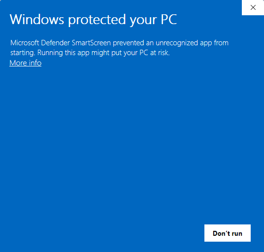
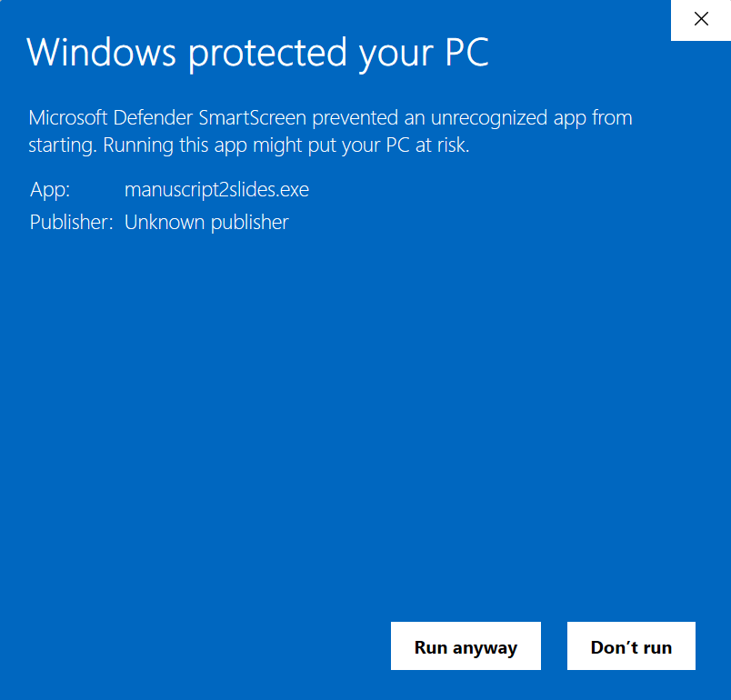

# How to Allow First Launch of Downloaded Release Binary on GitHub (Windows, macOS)

### Windows First Launch (SmartScreen Warning)

When launching the Windows binary for the first time, you'll see a SmartScreen warning:

This is normal for unsigned applications. Click "More info":

Then click "Run anyway" to launch the application.

▶️ [Video - Run Application Blocked by Windows Smart Screen](https://youtu.be/JnQbOfr9rP8)

### MacOS First Launch (unsigned app)

Since the app is not signed or notarized:

1. Right-click `manuscript2slides.app` from your downloads and select "Open" (required for unsigned apps)
2. macOS will warn the app is from an unidentified developer. To proceed:
   1. Click the upper-right question mark for the Apple help page on the topic.
   2. Click "Done" in the prompt to dismiss it.
   3. Open your macOS System Settings, go to Privacy & Security, and scroll down to Security.
   4. Note the message: `"manuscript2slides" was blocked to protect your Mac.`
   5. Click "Open Anyway"; input your user account info if prompted.
   6. The app should now run normally, and should not prompt you again on subsequent launches unless you get a new version.
3. When prompted to access your Documents folder, click "Allow" - the app stores its templates and sample files there
4. After the first launch, you can open it normally by double-clicking

▶️ [Video - Run App Blocked by macOS Security](https://youtu.be/W70Yxx62Vrc)